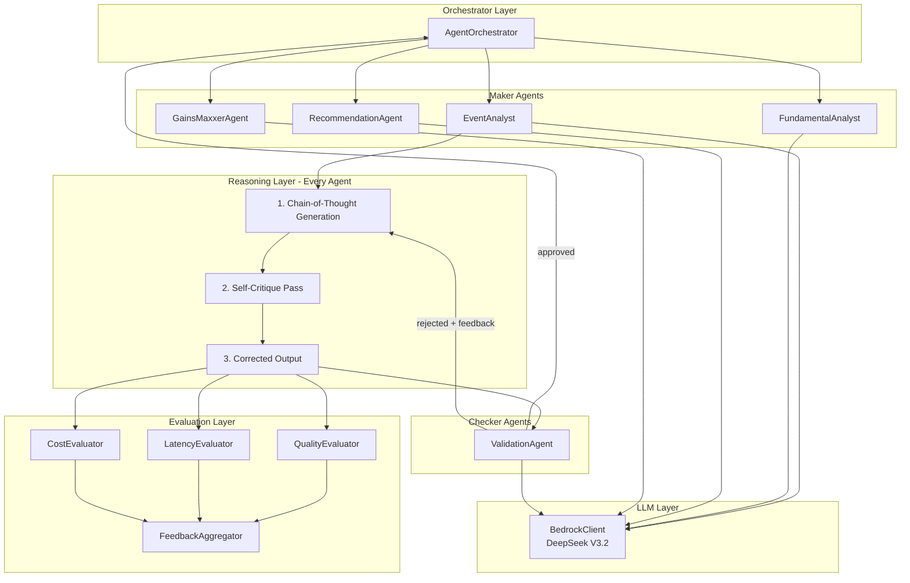
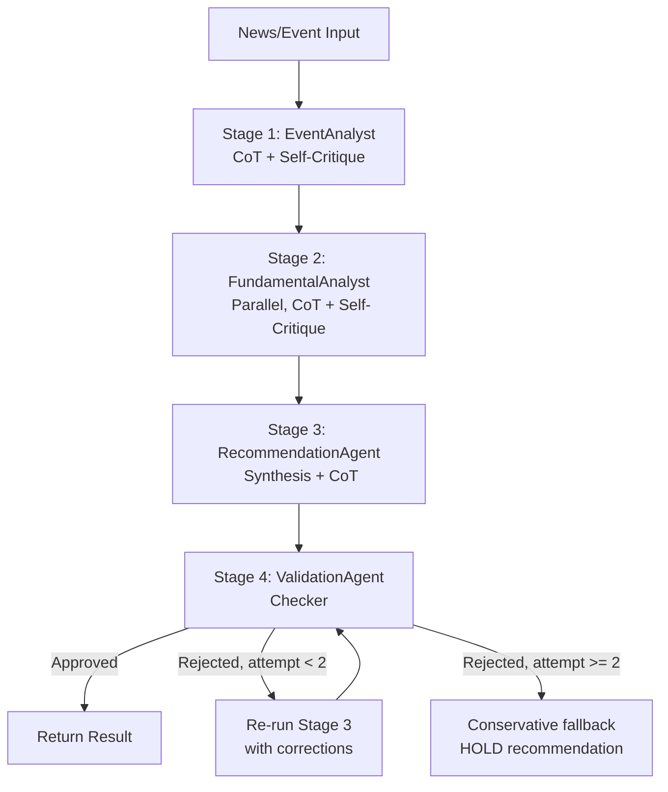

# TradeMaxxer: Multi-Step Agentic Backbone + Bedrock Migration

## Current State

The codebase has 4 agents (`BaseAgent`, `EventAnalyst`, `FundamentalAnalyst`, `AgentOrchestrator`) powered by the Anthropic SDK (`claude_client.py`). The architecture is clean -- **only 1 file** imports `anthropic` directly; all 10+ consumers use wrapper types (`ClaudeClient`, `ClaudeModel`, `ClaudeResponse`).

The agent workflows today are **single-pass**: generate output and return. There is no validation, no self-review, and no structured reasoning chain.

## Target State



---

## Phase 1: LLM Abstraction Layer (Bedrock + DeepSeek V3.2)

### What changes

Replace `anthropic` SDK with `boto3` Bedrock Runtime, using the Converse API. The public interface stays stable so all 10+ consumer files need only import renames.

### Key design decisions

- **Async strategy**: Use `asyncio.get_event_loop().run_in_executor()` to wrap sync `boto3.client.converse()` calls. This pattern already exists in the codebase (`FundamentalAnalyst._fetch_fundamentals` does the same for yfinance). No new dependency needed.
- **Tool calling**: Bedrock Converse API does **not** support `tool_use` for DeepSeek models. We implement manual tool calling via prompt-defined schemas + JSON response parsing (affects `GainsMaxxerAgent` only).
- **Prompt caching**: Anthropic-specific `cache_control` blocks are dropped. The existing Redis/in-memory response cache remains. This is a net simplification.
- **Model routing**: DeepSeek V3.2 is a single model (no Haiku/Sonnet split). All tasks route to it. The `LLMModel` enum stays extensible for future multi-model setups (e.g., adding DeepSeek R1 for deep reasoning).
- **Pricing**: DeepSeek V3.2 on Bedrock is ~5-8x cheaper ($0.62/M input, $1.85/M output vs Claude Sonnet's $3/M and $15/M).

### Files to change

**Core rewrite** -- [`src/trademaxxer/llm/claude_client.py`](src/trademaxxer/llm/claude_client.py):

- Rename `ClaudeClient` to `LLMClient`, `ClaudeModel` to `LLMModel`, `ClaudeResponse` to `LLMResponse`
- Replace `anthropic.AsyncAnthropic` with `boto3.client("bedrock-runtime")`
- Replace `client.messages.create()` with `client.converse()` wrapped in `run_in_executor`
- Replace exception types: `anthropic.RateLimitError` becomes `botocore.exceptions.ClientError` with throttling error codes
- Update `MODEL_PRICING` dict for DeepSeek V3.2
- Remove `_build_system_with_cache` (Anthropic prompt caching) -- system content goes in Converse's `system` parameter directly
- Auth via `AWS_BEARER_TOKEN_BEDROCK` env var

**Config** -- [`src/trademaxxer/config/settings.py`](src/trademaxxer/config/settings.py):

- Replace `anthropic_api_key` with `bedrock_api_key`, `aws_region` (default `us-east-1`)
- Replace `claude_default_model` with `llm_default_model` (default `us.deepseek.v3-2-v1:0`)
- Remove Keychain fallback for Anthropic; add for Bedrock key if needed

**Exports** -- [`src/trademaxxer/llm/__init__.py`](src/trademaxxer/llm/__init__.py):

- Update exports, add backward-compat aliases (`ClaudeClient = LLMClient`)

**Dependencies** -- [`requirements.txt`](requirements.txt):

- Remove `anthropic>=0.40.0`
- Add `boto3>=1.35.0`

**Import updates** (10+ files, mechanical rename):

- `agents/base_agent.py`, `agents/event_analyst.py`, `agents/fundamental_analyst.py`, `agents/orchestrator.py`
- `strategy/parser.py`, `insights/event_classifier.py`, `data/pipeline/sources/rbi_monitor.py`
- `apps/api/routers/agents.py`, `apps/api/routers/insights.py`, `apps/api/routers/strategy_parser.py`

**Tests** -- [`tests/unit/test_claude_client.py`](tests/unit/test_claude_client.py):

- Update mocks from Anthropic response objects to Bedrock Converse response dicts

**Environment** -- `.env`:

- Remove `ANTHROPIC_API_KEY`
- Add `BEDROCK_API_KEY` (maps to `AWS_BEARER_TOKEN_BEDROCK` internally)
- Add `AWS_REGION=us-east-1` (or whichever region has DeepSeek V3.2)

---

## Phase 2: Chain-of-Thought + Self-Critique in BaseAgent

### Chain-of-Thought (CoT)

Every agent prompt gets a structured reasoning prefix. Instead of "Provide analysis in JSON", the prompt becomes:

```
Think step by step before answering:

STEP 1 - Data Assessment: What data do I have? What's missing? What's reliable?
STEP 2 - Analysis: What does the data tell me? What are the key relationships?
STEP 3 - Hypothesis: What's my primary thesis? What would disprove it?
STEP 4 - Risk Check: What could go wrong? Am I overconfident?
STEP 5 - Conclusion: Final structured output.

Provide your reasoning in a "thinking" field, then your structured output.
```

The response schema adds a `thinking` field that captures the reasoning chain. This is stored in `AgentResponse.reasoning`.

### Self-Critique

Add a `_self_critique()` method to [`BaseAgent`](src/trademaxxer/agents/base_agent.py) that:

1. Takes the agent's raw output
2. Sends it back to the LLM with: *"Review this output for: (a) factual errors, (b) logical inconsistencies, (c) overconfident claims, (d) missing risk factors. List specific issues and corrections."*
3. If issues found, re-generates with the critique appended as context
4. Max 1 critique round (cost-controlled)

This is an opt-in method -- agents call `await self._self_critique(result)` before returning.

### Files to change

- [`src/trademaxxer/agents/base_agent.py`](src/trademaxxer/agents/base_agent.py) -- Add `_self_critique()`, `_complete_with_cot()`, update `AgentResponse` with `thinking` field
- [`src/trademaxxer/agents/event_analyst.py`](src/trademaxxer/agents/event_analyst.py) -- Update `_build_analysis_prompt()` with CoT structure, call self-critique
- [`src/trademaxxer/agents/fundamental_analyst.py`](src/trademaxxer/agents/fundamental_analyst.py) -- Same
- [`src/trademaxxer/llm/prompts/indian_context.py`](src/trademaxxer/llm/prompts/indian_context.py) -- Add CoT prompt templates

---

## Phase 3: New Agents

### 3a. ValidationAgent ([`src/trademaxxer/agents/validation_agent.py`](src/trademaxxer/agents/validation_agent.py))

The **checker** in the maker-checker pattern. Runs after every high-stakes agent output.

Checks:

- Logical consistency (does reasoning support the conclusion?)
- No hallucinated stock names (validates against `InstrumentMaster`)
- Risk factors are substantive (not generic "market risk")
- Confidence calibration (flags >85% confidence as suspect)
- Required fields present and valid

Output: `{ approved: bool, quality_score: 0-100, checks: {...}, corrections: [...] }`

Uses a single LLM call with a structured validation prompt. Lightweight -- designed to be fast.

### 3b. RecommendationAgent ([`src/trademaxxer/agents/recommendation_agent.py`](src/trademaxxer/agents/recommendation_agent.py))

Synthesizes event analysis + fundamental analyses into a final recommendation with:

- Top 3 picks with confidence scores
- Entry/target/stop-loss price levels
- Position sizing guidance
- Consolidated reasoning chain
- Risk factors (minimum 3)

Currently this synthesis logic lives inline in `AgentOrchestrator.analyze_event_opportunity()` (lines 211-260 of `orchestrator.py`). This refactors it into a dedicated agent that uses the LLM for intelligent synthesis rather than simple rule-based aggregation.

### 3c. GainsMaxxerAgent ([`src/trademaxxer/agents/gainsmaxxer_agent.py`](src/trademaxxer/agents/gainsmaxxer_agent.py))

Chat agent with tool use for the GainsMaxxer interface. Since Bedrock Converse doesn't support native tool_use for DeepSeek, implements **prompt-based tool calling**:

1. System prompt defines available tools as JSON schemas
2. Model outputs `{"tool_call": {"name": "get_stock_price", "args": {...}}}` when it needs data
3. Parser detects tool calls, executes them, passes results back
4. Model generates final response with real data

Tools: `get_stock_price`, `get_portfolio_positions`, `search_news`, `get_stock_fundamentals`, `analyze_event`, `create_strategy`

---

## Phase 4: Maker-Checker Orchestration

Refactor [`src/trademaxxer/agents/orchestrator.py`](src/trademaxxer/agents/orchestrator.py) to implement the multi-step flow:



Similarly for the strategy evaluation flow:

```
NL Input → StrategyParser (CoT) → StrategyValidation (Checker) → ViabilityAssessment → ExecutionApproval → PaperTrader
```

### Files to change

- [`src/trademaxxer/agents/orchestrator.py`](src/trademaxxer/agents/orchestrator.py) -- Major refactor: integrate ValidationAgent into all workflows, add retry logic, add RecommendationAgent stage
- [`apps/api/routers/agents.py`](apps/api/routers/agents.py) -- Update response models to include validation results and reasoning chain

---

## Phase 5: Evaluation Layer

### New files in `src/trademaxxer/agents/evaluators/`

- `quality_evaluator.py` -- Scores outputs on relevance, accuracy, actionability, reasoning, risk coverage (0-100 each). Uses a single lightweight LLM call.
- `latency_evaluator.py` -- Tracks response times, identifies slow paths. Pure metrics, no LLM.
- `cost_evaluator.py` -- Tracks token usage and cost per request. Pure metrics, no LLM.
- `feedback_aggregator.py` -- Aggregates eval scores + user thumbs-up/down + outcome tracking into improvement signals.

### Database schema addition

New migration adding `agent_evaluations` table (stores per-request quality scores, latency, cost, user feedback, predicted vs actual outcomes).

### Integration

Every orchestrated workflow automatically runs `QualityEvaluator.evaluate()` on the final output. Scores are logged to the database and exposed via the monitoring API. The evaluation is async and non-blocking -- it doesn't slow down the response.

---

## Risk / Open Questions

1. **DeepSeek V3.2 model ID on Bedrock**: Likely `us.deepseek.v3-2-v1:0` but needs verification against the Bedrock console. If V3.2 isn't available yet, V3.1 (`us.deepseek.v3-1-v1:0`) is confirmed available.
2. **Tool calling**: Manual prompt-based approach for GainsMaxxerAgent. Works well but requires careful prompt engineering and response parsing. If Bedrock adds native tool_use for DeepSeek later, we can swap to it without changing the agent interface.
3. **Async boto3**: Using `run_in_executor` is simple but creates thread pool overhead. If performance becomes an issue, migrate to `aioboto3` later.
4. **Cost of self-critique**: Doubles LLM calls per agent invocation. Mitigated by DeepSeek's low pricing ($0.62/M input). We add a `skip_critique` flag for time-sensitive paths.