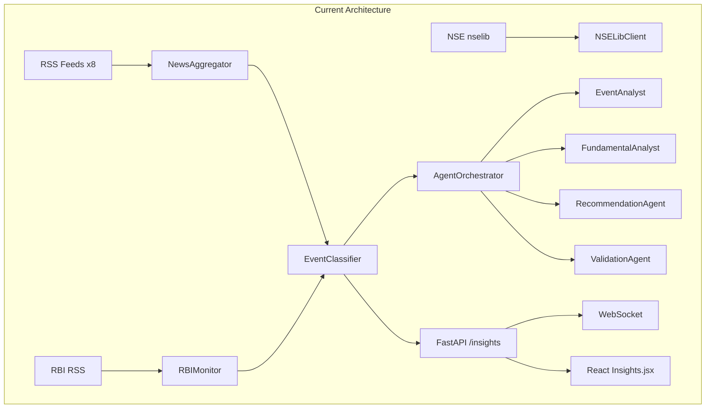
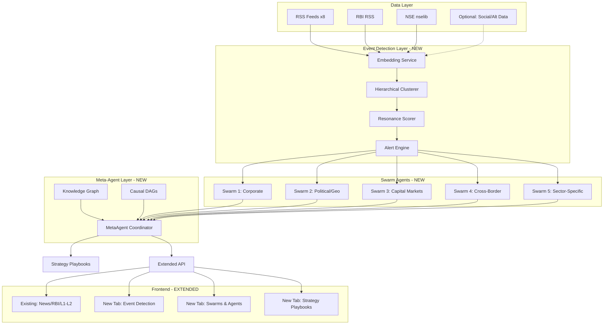

# Event-Driven Insights Architecture

## Current State

The existing system provides a strong foundation:

- **Frontend**: [`apps/frontend/src/pages/Insights.jsx`](apps/frontend/src/pages/Insights.jsx) (~2700 lines) -- news feed, L1/L2 asset analysis, RBI tracking, market pulse
- **Backend**: [`apps/api/routers/insights.py`](apps/api/routers/insights.py) -- 10 endpoints (RBI events, classify, market-pulse, exchange announcements)
- **Event Classifier**: [`src/trademaxxer/insights/event_classifier.py`](src/trademaxxer/insights/event_classifier.py) -- Claude Haiku, single-pass, 10 categories, impact/signal classification
- **Agent System**: [`src/trademaxxer/agents/`](src/trademaxxer/agents/) -- 5 agents + orchestrator with maker-checker validation, CoT + self-critique
- **Data Pipeline**: RSS (8 feeds), RBI monitor, NSE/nselib, Dhan API already configured
- **WebSocket**: Real-time event streaming on `ws://localhost:8080/ws/events`
- **Event-Driven Strategy**: [`src/trademaxxer/strategies/event_driven.py`](src/trademaxxer/strategies/event_driven.py) -- `EventDrivenStrategy` base + `RBIRateCutStrategy`, `EarningsSurpriseStrategy`

---

## Proposed Architecture

---

## Phase 1: Swarm Taxonomy + Playbooks (Content Layer)

**Goal**: Define all 20+ agents and 10 playbooks as structured data, render in a new tab within Insights.

### Backend

- **New file**: `src/trademaxxer/insights/swarm_registry.py`
  - Define `SwarmAgent` dataclass: `id, name, swarm, description, triggers, playbook, data_sources, linked_strategies`
  - Define `StrategyPlaybook` dataclass: `id, name, core_idea, linked_agents, key_stats, risks, workflow, execution_mode`
  - Populate a `SWARM_REGISTRY` dict with all 20+ agents across 5 swarms (from the spec)
  - Populate a `PLAYBOOK_REGISTRY` list with all 10 strategy cards
  - This is pure config/data -- no LLM calls, just structured taxonomy

- **New API endpoints** in [`apps/api/routers/insights.py`](apps/api/routers/insights.py):
  - `GET /api/v1/insights/swarms` -- returns all swarm agents grouped by swarm
  - `GET /api/v1/insights/swarms/{swarm_id}` -- returns agents for one swarm
  - `GET /api/v1/insights/playbooks` -- returns all 10 strategy playbooks
  - `GET /api/v1/insights/playbooks/{strategy_id}` -- returns one playbook with linked agents

### Frontend

- **Add 2 new tabs** within `Insights.jsx` (extending existing tab structure):
  - **"Event Swarms"** tab -- renders 5 swarm sections, each with agent cards showing triggers + playbook bullets
  - **"Strategy Playbooks"** tab -- renders 10 compact strategy cards with linked agents, stats, risk, workflow

---

## Phase 2: Event Detection Layer

**Goal**: Add hierarchical clustering + resonance scoring for incoming events.

### Backend -- New Module: `src/trademaxxer/insights/event_detection/`

- **`embedder.py`**: Wraps an embedding model (sentence-transformers or Bedrock Titan Embeddings) to convert event text to vectors. Uses `@st.cache_data` / LRU cache for dedup.
- **`clusterer.py`**: Implements hierarchical agglomerative clustering (scipy `linkage` + `fcluster`) on daily event embeddings. Produces clusters at day -> topic -> event granularity.
- **`resonance.py`**: Computes resonance score per cluster: `score = w1 * volume + w2 * growth_rate + w3 * source_diversity + w4 * ticker_concentration`. Threshold-based alerting (percentile vs 7-day rolling baseline).
- **`event_store.py`**: In-memory + optional SQLite persistence for event objects with schema: `id, type, timestamp_window, sources[], resonance_score, linked_tickers[], linked_sectors[], linked_swarm_agents[]`.

### Integration

- Extend `EventMonitorService` ([`src/trademaxxer/scheduler/event_monitor.py`](src/trademaxxer/scheduler/event_monitor.py)) to feed events into the detection pipeline
- Extend WebSocket channels to include `resonance_alerts`
- New API endpoints: `GET /api/v1/insights/events/clusters`, `GET /api/v1/insights/events/hot`

### Frontend

- **"Event Detection"** sub-panel within the "Event Swarms" tab or its own mini-tab
- Live resonance heatmap / sorted event list with cluster labels

---

## Phase 3: Specialized Swarm Agents (Code)

**Goal**: Implement the 20+ agents as Python classes extending `BaseAgent`.

### Backend -- New Module: `src/trademaxxer/agents/swarms/`

- **`base_swarm_agent.py`**: `SwarmAgent(BaseAgent)` with additional fields: `swarm_id`, `trigger_types[]`, `playbook_ref`, and a `should_activate(event)` method that checks if an incoming event matches the agent's triggers.
- **One file per swarm**: `corporate.py`, `political.py`, `capital_markets.py`, `cross_border.py`, `sector_specific.py`
  - Each file defines the specialized agents for that swarm
  - Each agent inherits from `SwarmAgent` and overrides `analyze()` with a domain-specific LLM prompt
  - Leverage existing patterns from `EventAnalyst` (CoT + self-critique) and `FundamentalAnalyst`

### Orchestrator Extension

- Extend `AgentOrchestrator` ([`src/trademaxxer/agents/orchestrator.py`](src/trademaxxer/agents/orchestrator.py)) to:
  - Route high-resonance events to the appropriate swarm agents based on `should_activate()`
  - Run activated agents in parallel (already has `asyncio.gather` pattern)
  - Aggregate results into a unified event response

---

## Phase 4: Meta-Agent Coordination Layer

**Goal**: Build cross-event correlation with knowledge graph and causal chains.

### Backend -- New Module: `src/trademaxxer/insights/meta_agent/`

- **`knowledge_graph.py`**: Simple in-memory directed graph (networkx) representing entity -> entity relationships. Edges tagged with: `relationship_type`, `empirical_strength` (0-1 hit rate), `lag_distribution` (mean/std in days).
- **`causal_chains.py`**: Pre-defined causal DAGs for known chains:
  - "Fed/RBI rate cut -> EM debt rally -> cross-border flow increase -> EM FX appreciation"
  - "OpenAI funding round -> data center demand surge -> REIT strength + GPU shortage -> semiconductor volatility"
  - "Geopolitical escalation -> oil spike -> airline margin compression -> travel stock selloff"
  - Chains are stored as lists of `(cause_event_type, effect_event_type, edge_metadata)`.
- **`meta_agent.py`**: `MetaAgent` class that:
  - Consumes all swarm agent outputs
  - Traverses the knowledge graph to find non-obvious downstream impacts
  - Ranks which swarm agents to prioritize for a new anchor event
  - Produces a "correlation report" with chain traces and confidence

### API

- `GET /api/v1/insights/correlations` -- current active cross-event chains
- `POST /api/v1/insights/simulate-chain` -- "what if" simulation for a hypothetical event

### Frontend

- Chain visualization in the Insights tab (simple directed graph or sequential cards showing propagation)

---

## Phase 5: Optional Data Sources

- Add a static section at the bottom of the Insights page listing 5-10 high-leverage feeds:
  - Global exchanges (NYSE, LSE corporate actions)
  - Global central banks (Fed, ECB, BoJ)
  - Social/alt data (Twitter/X firehose, Stocktwits, Google Trends)
- Each with enable/disable toggle and a justification note
- Backend: `src/trademaxxer/insights/optional_sources.py` -- config dict only, no actual integration until enabled

---

## Key Design Decisions

- **Extend, don't replace**: The existing Insights.jsx and backend router are preserved. New features are additive tabs/endpoints.
- **Data-first**: Phase 1 is pure structured data (swarm taxonomy + playbooks). No LLM calls needed. This ships fast and gives you the full architecture to review.
- **Lazy activation**: Swarm agents are registered but dormant. They only run when the detection layer flags a matching high-resonance event. This keeps LLM costs under control.
- **Existing patterns**: All new agents extend `BaseAgent` (CoT + self-critique). The orchestrator already supports parallel `asyncio.gather`. WebSocket channels already support multiple event types.
- **Indian market primary**: NSE/BSE and RBI are hardcoded as primary feeds. Global sources are marked optional.

---

## Files to Create/Modify

**New files:**
- `src/trademaxxer/insights/swarm_registry.py` -- swarm + playbook definitions
- `src/trademaxxer/insights/event_detection/embedder.py`
- `src/trademaxxer/insights/event_detection/clusterer.py`
- `src/trademaxxer/insights/event_detection/resonance.py`
- `src/trademaxxer/insights/event_detection/event_store.py`
- `src/trademaxxer/agents/swarms/base_swarm_agent.py`
- `src/trademaxxer/agents/swarms/corporate.py` (6 agents)
- `src/trademaxxer/agents/swarms/political.py` (5 agents)
- `src/trademaxxer/agents/swarms/capital_markets.py` (5 agents)
- `src/trademaxxer/agents/swarms/cross_border.py` (4 agents)
- `src/trademaxxer/agents/swarms/sector_specific.py` (4 agents)
- `src/trademaxxer/insights/meta_agent/knowledge_graph.py`
- `src/trademaxxer/insights/meta_agent/causal_chains.py`
- `src/trademaxxer/insights/meta_agent/meta_agent.py`
- `src/trademaxxer/insights/optional_sources.py`

**Modified files:**
- [`apps/api/routers/insights.py`](apps/api/routers/insights.py) -- add swarm/playbook/detection/correlation endpoints
- [`apps/frontend/src/pages/Insights.jsx`](apps/frontend/src/pages/Insights.jsx) -- add "Event Swarms", "Strategy Playbooks" tabs
- [`src/trademaxxer/agents/orchestrator.py`](src/trademaxxer/agents/orchestrator.py) -- extend to route events to swarm agents
- [`src/trademaxxer/scheduler/event_monitor.py`](src/trademaxxer/scheduler/event_monitor.py) -- feed into detection pipeline
- [`apps/api/websocket.py`](apps/api/websocket.py) -- add `resonance_alerts` channel