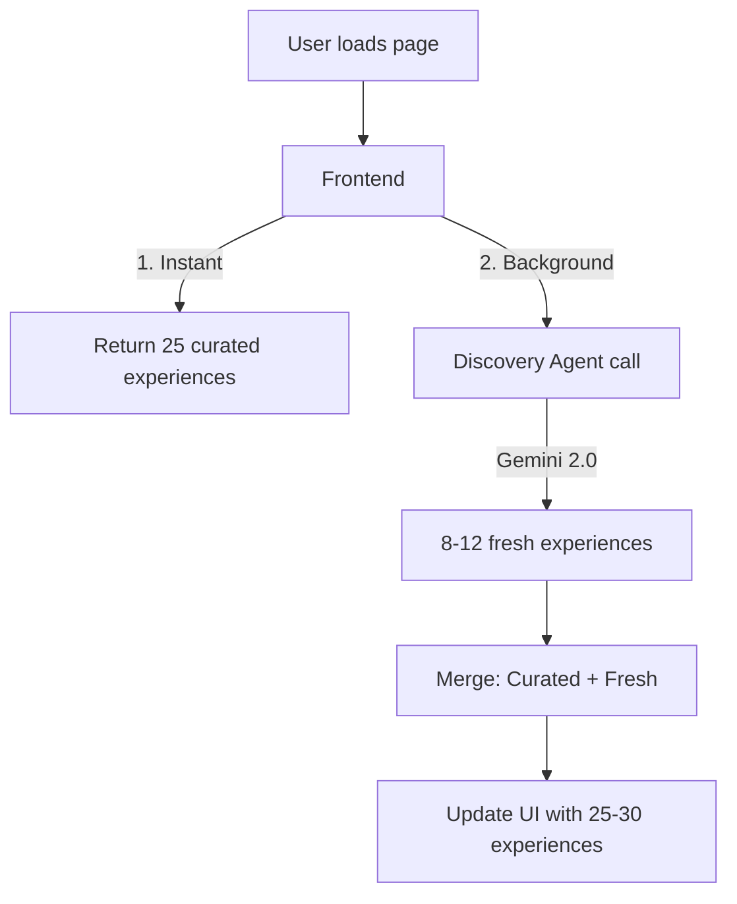

# Expand Event Fetching with Hybrid Approach

## Problem

- Current system returns only 5-10 experiences from the Discovery Agent
- Frontend fallback only has 12 curated experiences
- Users want 20-30 experiences with fast loading

## Solution Architecture



## Changes Required

### 1. Expand Curated Experiences Database

**File:** [frontend/src/lib/sample-data.ts](frontend/src/lib/sample-data.ts)

Add 13 more curated Bangalore experiences (total: 25) covering categories:

- Food: Vidyarthi Bhavan, Brahmin's Coffee Bar, MTR Lalbagh, Airlines Hotel
- Craft: Candle-making at Blossoms, Perfume workshop at Jayanagar
- Nature: Hesaraghatta Lake, Nandi Hills sunrise
- Art: National Gallery of Modern Art, Rangoli Metro Art Center
- Nightlife: Toit Brewery, The Humming Tree
- Heritage: Tipu Sultan's Summer Palace

### 2. Create Curated Data on Backend

**New File:** `backend/data/curated_experiences.py`

Mirror the frontend curated data in Python for server-side use:

- 25 pre-defined experiences with full metadata
- Proper coordinates, categories, timings
- Used as instant response before agent completes

### 3. Update Discovery Endpoint for Hybrid Mode

**File:** [backend/main.py](backend/main.py) - `/api/discover` endpoint

Modify to support hybrid fetching:

```python
@app.post("/api/discover")
async def discover_experiences(request: DiscoverRequest):
    # 1. Return curated data immediately if "fast_mode=true"
    # 2. Otherwise, combine curated + agent-generated
    
    curated = get_curated_experiences(request.city)  # Instant, ~25
    
    if request.fast_mode:
        return DiscoverResponse(experiences=curated[:request.limit])
    
    # Run agent in background for fresh experiences
    agent_experiences = await run_discovery_agent_async(...)  # 8-12 fresh
    
    # Merge and deduplicate
    combined = merge_experiences(curated, agent_experiences)
    return DiscoverResponse(experiences=combined[:request.limit])
```

### 4. Add Streaming/Progressive Loading Option

**File:** [backend/main.py](backend/main.py)

Add new endpoint for progressive loading:

```python
@app.post("/api/discover/stream")
async def discover_stream(request: DiscoverRequest):
    """Return curated first, then stream agent results."""
    # Returns curated immediately
    # Frontend can call /api/discover/agent for fresh ones
```

### 5. Update Frontend for Progressive Loading

**File:** [frontend/src/hooks/useExperiences.ts](frontend/src/hooks/useExperiences.ts)

Update hook to support two-phase loading:

```typescript
// Phase 1: Load curated instantly (fast_mode=true)
// Phase 2: Fetch agent-enriched in background
// Phase 3: Merge and update UI

interface UseExperiencesOptions {
  // ... existing options
  progressiveLoad?: boolean;  // Enable two-phase loading
}
```

**File:** [frontend/src/app/explore/page.tsx](frontend/src/app/explore/page.tsx)

Add visual indicator:

- Show curated experiences immediately
- Display "AI discovering more..." badge while agent runs
- Animate new experiences appearing

### 6. Update Discovery Agent Prompt

**File:** [backend/agents/discovery_agent.py](backend/agents/discovery_agent.py)

Update prompt to:

- Generate 10-15 experiences (up from 5-10)
- Focus on unique/lesser-known places (avoid duplicating curated data)
- Add instruction to complement existing curated set

### 7. Update API Schema

**File:** [backend/state/schemas.py](backend/state/schemas.py)

Add to DiscoverRequest:

```python
fast_mode: bool = Field(default=False, description="Return curated data only for instant load")
```

## Implementation Order

1. Add more curated experiences to frontend sample-data.ts (fastest impact)
2. Create backend curated_experiences.py
3. Update /api/discover endpoint for hybrid mode
4. Update useExperiences hook for progressive loading
5. Add visual indicators on explore page
6. Update discovery agent prompt for more experiences

## Expected Results

| Metric | Before | After |

|--------|--------|-------|

| Experiences shown | 5-12 | 25-30 |

| Initial load time | 3-5s (agent) | <200ms (curated) |

| Full load time | 3-5s | 3-5s (background) |

| User experience | Wait for all | Instant + progressive |