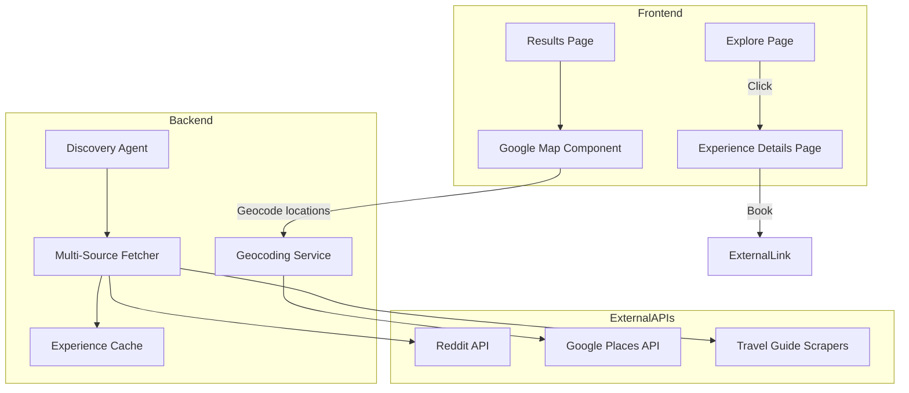

# Sidequest Experience Enhancements

## Current Issues Identified

**Map Bugs (Root Cause)**: The backend returns experiences WITHOUT coordinates. The frontend generates random coordinates as fallback (lines 49-61 of `google-map.tsx`), causing wrong locations and directions.

## Architecture Overview



---

## Phase 1: Bug Fixes (Map + Directions)

### 1.1 Add Geocoding Service (Backend)

Create `/backend/utils/geocoding.py`:
- Use Google Geocoding API to convert "Clay Station, Indiranagar, Bangalore" to lat/lng
- Cache results to avoid repeated API calls
- Fallback to neighborhood center if specific location not found

### 1.2 Update Discovery Agent Output

Modify `/backend/agents/discovery_agent.py`:
- After LLM generates experiences, geocode each location
- Add coordinates to the experience object before returning

### 1.3 Fix Get Directions

Update `/frontend/src/components/google-map.tsx`:
- Change directions URL to use place name search instead of coordinates:
  ```
  https://www.google.com/maps/dir/?api=1&destination=${encodeURIComponent(exp.name + ', ' + exp.location + ', Bangalore')}
  ```

---

## Phase 2: Experience Details Page

### 2.1 Create Details Page Route

Create `/frontend/src/app/experience/[id]/page.tsx`:
- Display full experience information
- Show: name, description, location, timing, budget, solo-friendly status
- Show cultural context and social scaffolding if available
- Add "Book Now" button (redirect to source or booking link)
- Add map with single marker
- Show weather suitability (rain handling)
- Show source attribution

### 2.2 Update Explore Page Click Handler

Modify `/frontend/src/app/explore/page.tsx`:
- On card click, navigate to `/experience/[id]` instead of `/generate`
- Pass experience data via URL params or sessionStorage

---

## Phase 3: Rain Handling / Weather Display

### 3.1 Add Weather Component

Create `/frontend/src/components/weather-indicator.tsx`:
- Display current weather suitability
- Show "Indoor activity - rain-proof" or "Outdoor - check weather"
- Use existing `weather_suitability` field from `DiscoveryExperience` type

### 3.2 Integrate Weather in UI

- Add to Experience Details page
- Add to Narrative Block component
- Add to Results page experience cards

---

## Phase 4: Time Interval Filtering

### 4.1 Parse Time from User Prompt

Update `/backend/agents/discovery_agent.py`:
- Extract time references from query (e.g., "morning", "evening", "7pm-9pm", "weekend")
- Add time constraints to the LLM prompt
- Filter/prioritize experiences matching the time window

### 4.2 Add Time Filter to Frontend

Update `/frontend/src/app/explore/page.tsx`:
- Add time-based quick filters: "Morning", "Afternoon", "Evening", "Night"
- Filter experiences by timing field

---

## Phase 5: Multi-Source Experience Fetching

### 5.1 Create Source Fetcher Service

Create `/backend/services/experience_sources.py`:
- Reddit API integration (using existing `test_discovery_sources.py` as base)
- Travel guide scraper (Karnataka Tourism, Bangalore Tourism)
- Mock X/Instagram data (real API requires approval)

### 5.2 Add Experience Cache with TTL

Create `/backend/services/experience_cache.py`:
- In-memory cache with 10-minute TTL
- Store experiences by city + category
- Background refresh every 10 minutes

### 5.3 Integrate with Discovery Agent

Update `/backend/agents/discovery_agent.py`:
- Fetch from cache first
- Merge cached experiences with LLM-generated ones
- Deduplicate by name similarity

---

## Phase 6: Explore Page to Details Flow

### 6.1 Update Click Handler

Modify `/frontend/src/app/explore/page.tsx`:
- Remove redirect to `/generate`
- Navigate to `/experience/[id]` instead
- No agent execution needed for browsing

### 6.2 Add Booking/Source Links

In Experience Details page:
- If source is Instagram: link to post
- If source is Reddit: link to thread
- If bookable: show booking button
- Show "Found via {source}" attribution

---

## Files to Create/Modify

| Action | File |
|--------|------|
| Create | `backend/utils/geocoding.py` |
| Create | `backend/services/experience_sources.py` |
| Create | `backend/services/experience_cache.py` |
| Create | `frontend/src/app/experience/[id]/page.tsx` |
| Create | `frontend/src/components/weather-indicator.tsx` |
| Modify | `backend/agents/discovery_agent.py` |
| Modify | `frontend/src/components/google-map.tsx` |
| Modify | `frontend/src/app/explore/page.tsx` |
| Modify | `frontend/src/components/narrative-block.tsx` |
| Modify | `backend/.env` (add GOOGLE_MAPS_API_KEY) |

---

## Environment Variables Needed

```
GOOGLE_MAPS_API_KEY=xxx  # For geocoding
REDDIT_CLIENT_ID=xxx     # Optional, for Reddit API
REDDIT_CLIENT_SECRET=xxx # Optional, for Reddit API
```
