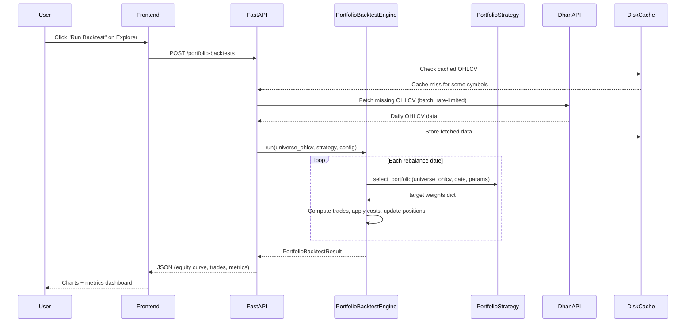

# Strategy Discovery, Implementation & Backtest Orchestrator

## Assumptions (proceeding with these since clarification was skipped)

- **Universe**: Fixed current NIFTY 50 (existing `data/universes/nifty50.csv`), interface designed so rolling membership can be swapped in later.
- **Architecture**: New `PortfolioStrategy` + `PortfolioBacktestEngine` **alongside** the existing single-stock system. No breaking changes.
- **Transaction costs**: Use existing `IndiaEquityCostModel` (realistic retail: STT + exchange fees + brokerage + slippage).
- **Capital base**: Rs 50,00,000 default (realistic for a 5-10 stock concentrated portfolio from NIFTY 50).
- **Execution fill**: Next-day open with slippage (signal on today's close, fill at next open + slippage BPS).
- **Initial batch**: 5 strategies covering momentum, value, quality, low-vol, and dual momentum.
- **Data**: Daily OHLCV via Dhan API for all NIFTY 50 stocks. No intraday needed for these strategies.

---

## Critical Architecture Gap

The current system is **single-stock, signal-based**:

```
Strategy.generate_signals(ohlcv_one_stock) -> BUY/SELL/HOLD per bar
BacktestEngine.run_single(symbol, ohlcv, strategy) -> equity curve for one stock
```

The new system needs to be **cross-sectional, portfolio-weight-based**:

```
PortfolioStrategy.select_portfolio(ohlcv_dict[all_50_stocks]) -> {symbol: weight} target portfolio
PortfolioBacktestEngine.run(universe_ohlcv, strategy) -> multi-stock equity curve + trade log
```

These are complementary, not conflicting. The existing system stays for single-stock technical strategies; the new system handles factor/portfolio strategies.

---

## Phase 1: Backend Infrastructure (core engine)

### 1A. `PortfolioStrategy` Base Class

New file: `[src/trademaxxer/strategies/portfolio_base.py](src/trademaxxer/strategies/portfolio_base.py)`

```python
class PortfolioStrategy(ABC):
    @abstractmethod
    def select_portfolio(
        self, universe_ohlcv: dict[str, pd.DataFrame], current_date: pd.Timestamp, params: dict
    ) -> dict[str, float]:
        """Return target weights {symbol: weight} summing to <= 1.0."""
```

Key design points:

- Receives OHLCV dict keyed by symbol for the full universe.
- Called once per rebalance date.
- Returns target portfolio weights (0.0 means exit, absent means no position).
- `metadata` property same pattern as existing `Strategy`.
- `PORTFOLIO_STRATEGY_REGISTRY` dict for lookup (same pattern as `STRATEGY_REGISTRY` in `[quantconnect.py](src/trademaxxer/strategies/quantconnect.py)`).

### 1B. `PortfolioBacktestEngine`

New file: `[src/trademaxxer/backtesting/portfolio_engine.py](src/trademaxxer/backtesting/portfolio_engine.py)`

Responsibilities:

- Load daily OHLCV for all symbols in universe from Dhan (via existing `DhanClient`).
- Generate rebalance schedule (e.g., monthly on last trading day).
- On each rebalance date, call `strategy.select_portfolio()` to get target weights.
- Compute trades needed to transition from current portfolio to target.
- Apply fills at next-day open + slippage, deducting costs via existing `IndiaEquityCostModel`.
- Track multi-stock portfolio equity curve, positions, cash.
- Output: equity curve DataFrame, trade log, summary metrics (CAGR, Sharpe, max DD, turnover, hit ratio).
- Integrates with existing `AuditStore` for audit trail.

Config:

```python
@dataclass
class PortfolioBacktestConfig:
    initial_cash: float = 50_00_000.0
    slippage_bps: float = 5.0
    rebalance_freq: str = "M"  # M=monthly, W=weekly, Q=quarterly
    fill_mode: str = "next_open"  # "next_open" or "close"
    max_positions: int = 10
    max_weight_per_stock: float = 0.20
    min_weight_per_stock: float = 0.02
```

### 1C. Universe Data Loader

New file: `[src/trademaxxer/data/universe_loader.py](src/trademaxxer/data/universe_loader.py)`

- Reads `data/universes/nifty50.csv` for the symbol list.
- Batch-fetches daily OHLCV for all 50 symbols from Dhan API (respecting rate limits).
- Caches to disk (`data/cache/ohlcv/{symbol}.parquet`) to avoid redundant API calls.
- Returns `dict[str, pd.DataFrame]` aligned to a common date index.
- Handles missing data / delisted stocks gracefully (drop from universe for that period).

---

## Phase 2: Strategy Implementations (5 strategies)

New file: `[src/trademaxxer/strategies/portfolio_strategies.py](src/trademaxxer/strategies/portfolio_strategies.py)`

All implement `PortfolioStrategy` and follow the template from the prompt.

### Strategy 1: Cross-Sectional Momentum (12-1)

- **Origin**: "Momentum Effect in Country Equity Indexes" (QuantConnect), localized to NIFTY 50 stocks.
- **Signal**: 12-month return excluding last 1 month, ranked cross-sectionally.
- **Selection**: Top 5 by momentum score, equal-weight.
- **Rebalance**: Monthly.
- **Expected target**: >12% CAGR (documented 10-30% in literature for cross-sectional momentum).

### Strategy 2: Value Composite (Book-to-Market + Earnings Yield)

- **Origin**: Fama-French value factor, adapted to NIFTY 50 using price-based proxies.
- **Signal**: Trailing 12M earnings yield proxy (inverse of P/E approximated from price trajectory) + low price-to-52W-high ratio.
- **Selection**: Top 5 by composite value score, equal-weight.
- **Rebalance**: Monthly.
- **Note**: Pure price-based value proxy since we don't have fundamental data from Dhan. This is a limitation we document clearly.

### Strategy 3: Low-Volatility Anomaly

- **Origin**: Ang et al. (2006), Baker et al. (2011) — low-vol stocks outperform on risk-adjusted basis.
- **Signal**: Trailing 60-day realized volatility, ranked ascending (lowest vol = best).
- **Selection**: Top 10 lowest-vol stocks, equal-weight.
- **Rebalance**: Monthly.

### Strategy 4: Dual Momentum (Absolute + Relative)

- **Origin**: Gary Antonacci's "Dual Momentum Investing", adapted to NIFTY 50.
- **Signal**: Absolute momentum (12M return > risk-free 6% annualized) AND relative momentum (above median of universe).
- **Selection**: Stocks passing both filters, equal-weight, max 10.
- **Rebalance**: Monthly.
- **Cash rule**: If fewer than 3 stocks pass, go to cash (hold no positions).

### Strategy 5: Quality-Momentum Composite

- **Origin**: AQR "Quality Minus Junk" + momentum. Upgrade of existing single-stock `QualityMomentumStrategy` to cross-sectional.
- **Signal**: Quality = inverse of 60-day return volatility (return stability). Momentum = 12-1 month return. Composite = 0.5 * quality_rank + 0.5 * momentum_rank.
- **Selection**: Top 5 by composite score, equal-weight.
- **Rebalance**: Monthly.

Each strategy class includes:

- `metadata` with id, version, name, description.
- `validate_params()` for parameter bounds.
- `select_portfolio()` implementing the logic.
- A class-level `DEFAULT_PARAMS` dict.

---

## Phase 3: API Endpoints

Modify: `[apps/api/main.py](apps/api/main.py)`

### New endpoints:

- `POST /portfolio-backtests` — Run a portfolio-level backtest. Accepts strategy_id, params, universe, date range. Returns run_id.
- `GET /portfolio-backtests/{run_id}` — Retrieve results (equity curve, trades, metrics).
- `GET /portfolio-strategies` — List all registered portfolio strategies with metadata + default params.
- `POST /portfolio-strategies/{id}/scan` — Run a live scan: fetch current NIFTY 50 data, run strategy, return current target portfolio (no backtest, just "what would I buy today?").

These sit alongside the existing `/backtests` endpoints (no changes to those).

---

## Phase 4: Frontend — Strategy Explorer Page + Run Button

### 4A. New Explorer Page

New file: `[apps/frontend/src/pages/StrategyExplorer.jsx](apps/frontend/src/pages/StrategyExplorer.jsx)`

- Grid/list of portfolio strategies fetched from `GET /portfolio-strategies`.
- Each card shows: name, category, expected CAGR target, rebalance freq, status badge.
- "Why it's interesting" one-liner.
- Click to expand: full description, parameters, "Try it" config (date range picker + param overrides).
- **Run Backtest** button: calls `POST /portfolio-backtests`, shows loading state, navigates to results.
- **Live Scan** button: calls `POST /portfolio-strategies/{id}/scan`, shows current recommended portfolio.

### 4B. Update Strategy Library

Modify: `[apps/frontend/src/pages/StrategyLibrary.jsx](apps/frontend/src/pages/StrategyLibrary.jsx)`

- Add a "Portfolio Strategies" tab/section alongside existing single-stock strategies.
- Each portfolio strategy card links to the Explorer detail view.

### 4C. Strategy Results Page Update

Modify: `[apps/frontend/src/pages/StrategyResults.jsx](apps/frontend/src/pages/StrategyResults.jsx)`

- Handle portfolio backtest results: multi-stock equity curve, portfolio composition over time, trade log table, metrics dashboard (CAGR, Sharpe, max DD, turnover).

### 4D. Routing

Modify: `[apps/frontend/src/App.jsx](apps/frontend/src/App.jsx)`

- Add route: `/explorer` -> `StrategyExplorer`
- Add to navigation bar in `[apps/frontend/src/components/Navigation.jsx](apps/frontend/src/components/Navigation.jsx)`

---

## Phase 5: Strategy Definition JSON Registry

New file: `[src/trademaxxer/strategies/portfolio_registry.json](src/trademaxxer/strategies/portfolio_registry.json)`

A single JSON file containing all 5 strategy definitions in the template format from the prompt (id, name, category, universe, parameters, status, origin, etc.). This serves as:

- The canonical source of truth for strategy metadata.
- Consumed by both backend (for API responses) and frontend (for display).
- Separates strategy config from strategy logic.

---

## Data Flow (End-to-End)




---

## Files Changed / Created Summary


| Action     | Path                                                 | What                                                       |
| ---------- | ---------------------------------------------------- | ---------------------------------------------------------- |
| **Create** | `src/trademaxxer/strategies/portfolio_base.py`       | `PortfolioStrategy` ABC + `PortfolioStrategyMetadata`      |
| **Create** | `src/trademaxxer/strategies/portfolio_strategies.py` | 5 strategy implementations + `PORTFOLIO_STRATEGY_REGISTRY` |
| **Create** | `src/trademaxxer/strategies/portfolio_registry.json` | Strategy definitions in template format                    |
| **Create** | `src/trademaxxer/backtesting/portfolio_engine.py`    | `PortfolioBacktestEngine` + `PortfolioBacktestConfig`      |
| **Create** | `src/trademaxxer/data/universe_loader.py`            | Universe OHLCV batch loader + cache                        |
| **Modify** | `apps/api/main.py`                                   | Add 4 new portfolio endpoints                              |
| **Create** | `apps/frontend/src/pages/StrategyExplorer.jsx`       | Explorer page                                              |
| **Modify** | `apps/frontend/src/pages/StrategyLibrary.jsx`        | Add portfolio strategies tab                               |
| **Modify** | `apps/frontend/src/pages/StrategyResults.jsx`        | Handle portfolio backtest results                          |
| **Modify** | `apps/frontend/src/App.jsx`                          | Add `/explorer` route                                      |
| **Modify** | `apps/frontend/src/components/Navigation.jsx`        | Add Explorer nav item                                      |
| **Modify** | `apps/frontend/src/lib/api.js`                       | Add portfolio API client functions                         |


---

## Known Limitations & Mitigations

1. **Survivorship bias**: Using current NIFTY 50 list backfilled historically. Mitigation: document clearly; design `UniverseProvider` interface so rolling membership can be plugged in.
2. **No fundamental data from Dhan**: Value strategy uses price-based proxies only. Mitigation: design strategy params to accept fundamental data source when available.
3. **Dhan historical data depth**: May be limited to 5-10 years depending on the endpoint. Mitigation: use max available, report actual date range in results.
4. **Rate limits on Dhan**: 50 stocks x daily OHLCV = significant API load. Mitigation: aggressive disk caching, only fetch deltas.

